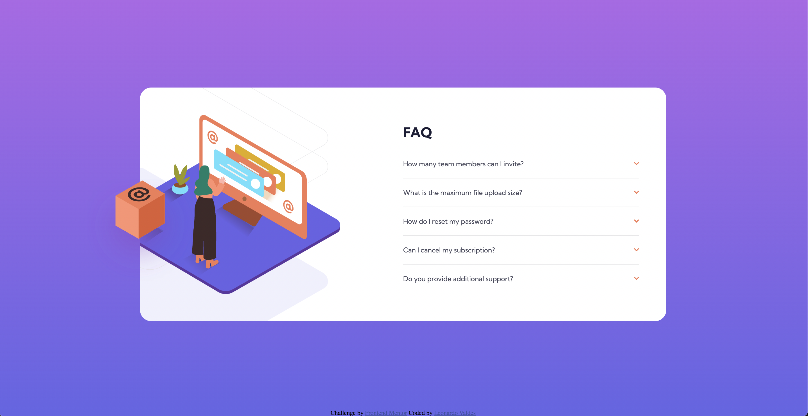

# Frontend Mentor - FAQ accordion card solution

This is a solution to the [FAQ accordion card challenge on Frontend Mentor](https://www.frontendmentor.io/challenges/faq-accordion-card-XlyjD0Oam). Frontend Mentor challenges help you improve your coding skills by building realistic projects.

## Table of contents

- [Overview](#overview)
  - [The challenge](#the-challenge)
  - [Screenshot](#screenshot)
  - [Links](#links)
- [My process](#my-process)
  - [Built with](#built-with)
  - [What I learned](#what-i-learned)
  - [Useful resources](#useful-resources)
- [Author](#author)

**Note: Delete this note and update the table of contents based on what sections you keep.**

## Overview

### The challenge

Users should be able to:

- View the optimal layout for the component depending on their device's screen size
- See hover states for all interactive elements on the page
- Hide/Show the answer to a question when the question is clicked

### Screenshot



### Links

- Solution URL: [Github](https://your-solution-url.com)
- Live Site URL: [Live Demo](https://sprightly-blini-09df17.netlify.app/)

## My process

### Built with

- Semantic HTML5 markup
- CSS Variables
- Flexbox
- Mobile-first workflow
- JS

### What I learned

CSS Positioning, using ::before pseudoselector, having to use max-height for content animation

```css
main::before {
	content: '';
	position: absolute;
	background-image: url('images/illustration-box-desktop.svg');
	background-repeat: no-repeat;
	background-position: center;
	background-size: 40%;
	left: -25%;
	top: 11%;
	width: 50%;
	height: 100%;
	z-index: 1;
}

main .accordion .faq .accordion-item .content {
	position: relative;
	height: auto;
	max-height: 0;
	overflow: hidden;
	transition: max-height 0.5s;
	color: var(--text-gray-blue);
}

main .accordion .faq .accordion-item.active .content {
	max-height: 5rem;
}
```

Accordion item logic

```js
const faq = document.querySelector('.faq');

faq.addEventListener('click', (e) => {
	const target = e.target;
	if (target.classList.contains('heading') || target.parentNode.classList.contains('heading')) {
		let heading = target;
		if (target.parentNode.classList.contains('heading')) {
			heading = target.parentNode;
		}
		const item = heading.parentNode;
		item.classList.toggle('active');
	}
});
```

### Useful resources

- [Transitions on auto dimensions](https://css-tricks.com/using-css-transitions-auto-dimensions/) - This helped me fix an issue i had with animations not working on elements whose heights are set to auto

## Author

- Website - [Leonardo Valdes](https://valdes91.github.io/)
- Frontend Mentor - [@valdes91](https://www.frontendmentor.io/profile/valdes91)
- Linkedin - [Leonardo Valdes](https://www.linkedin.com/in/leonardovaldesjr/)
